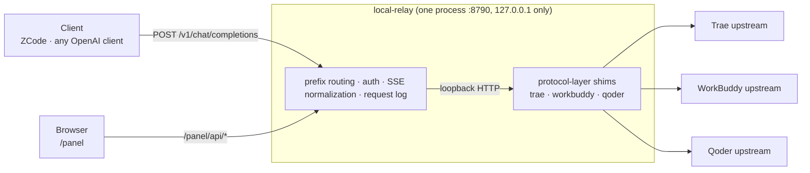

<div align="center">

**English** · [简体中文](README.zh-CN.md)

# local-relay

**The protocol layers inside three DSH subscription plugins, lifted out and assembled into a local OpenAI-compatible gateway that runs without DSH.**

One local HTTP endpoint, six model channels, and a control panel to go with it.

[](https://nodejs.org)
[](#development)
[](#development)
[](#connecting-a-client)
[](#known-limitations)
[](#license)

[What it is](#what-it-is) · [Features](#features) · [How it works](#how-it-works) · [Quick start](#quick-start) ·
[Connecting a client](#connecting-a-client) · [Model naming](#model-naming) · [Configuration](#configuration) ·
[Control panel](#control-panel) · [Known limitations](#known-limitations) · [FAQ](#faq)

</div>

---

## What it is

`local-relay` takes the three DSH subscription plugins — `dsh-connect-trae`, `dsh-workbuddy-connect` and `dsh-qoder-connect` — and **reuses the protocol layers already inside them, unchanged**, assembling them into a single standalone process:

- outward it is an **OpenAI-compatible gateway** (`/v1/models`, `/v1/chat/completions`, SSE streaming included) that any client with custom OpenAI endpoint support can talk to;
- inward it is the three channels' protocol stacks, **reading the sign-in state your desktop clients already have** — no API key to paste, no account to import;
- and it ships a **React control panel** (`/panel`) for balances, account switching, model toggles, reasoning probes and a request log.

It is **not** a relay or proxy service and it talks to no third-party server: the process binds `127.0.0.1` only, credentials are read locally, and requests go straight to the upstreams you are signed in to.

## Features

| | |
|---|---|
| **Six channels** | `trae` `traeg` (Trae CN / intl), `wb` `wbai` (WorkBuddy CN / intl), `qoder` `qoderg` (Qoder CN / intl) — each with its own credentials, catalog and sign-in state |
| **OpenAI compatible** | `GET /v1/models`, `POST /v1/chat/completions` (streaming and non-streaming), `GET /healthz`; models are routed by a `channel/model-id` prefix |
| **Stream normalization** | Upstream SSE is normalized into standard OpenAI chunks: `role` only on the first frame, `reasoning_content` passed through, `tool_calls` aggregated from deltas; non-streaming requests get a fully assembled `message` and `usage` |
| **Zero runtime dependencies** | The root `package.json` has no `dependencies` at all — Node built-ins only. The extracted protocol layers ship with their dependency stubs so they stay reviewable in a diff |
| **Control panel** | Five pages: overview, one per channel, and the request log — balances, check-in, model toggles, reasoning probes and account switching all live there |
| **Strict model routing** | A model name must carry its prefix and hit a real ID. Display names, a missing prefix or a case mismatch all return 404 `unknown-model` instead of being silently forwarded into an upstream error |
| **Credentials stay local** | Panel API responses are filtered through a field whitelist — no tokens, PATs or bearer values. The request log stores metadata only, never request or response bodies |
| **Isolated state** | The gateway's own catalog, hidden-model list and probe results live in `~/.dsh/local-relay/`, so they never overwrite the DSH plugins' |

## How it works



The key fact: **each of these plugins already contains an OpenAI-compatible loopback gateway of its own** (`createTraeShim` / `createWorkBuddyShim` / `createQoderShim`, exposing `/healthz`, `/v1/models`, `/v1/chat/completions`) — DSH's pi-ai provider is merely one client of it. Their protocol layers are plain functions and injection-style classes (`credential()`, `identity()`, `fetchImpl` are all injected from outside), so they can be wired up outside DSH.

So what this project does is: **supply those shims with the three things they expect from the outside — credentials, catalog and preferences — then put all six behind one port and fan requests out by prefix.** Not reverse-engineering the upstreams from scratch.

> The protocol layers under `shims/` come from these three MIT-licensed packages: `dsh-connect-trae`, `dsh-workbuddy-connect` and `dsh-qoder-connect`, kept together with their own copyright notices. The `@deepseek-ai/*` and `@earendil-works/pi-ai` entries in the same directory are **not** third-party code — they are minimal stubs written here so the plugins can resolve their imports outside DSH. See [Credits](#credits).

The full path of one request:

1. The client calls `/v1/chat/completions` with `channel/model-id`; the gateway picks the provider by prefix and verifies the model ID really exists (404 otherwise — nothing is sent upstream).
2. Channel-specific compatibility runs on the way out (the WorkBuddy channel, for instance, strips the billing header and client-signature sentence its upstream WAF rejects as anomalous).
3. The request goes to that channel's shim, where the plugin's own transport encodes it into upstream shape (`config_name` for Trae, the private tools format, and so on).
4. The upstream SSE stream is normalized on the way back; simultaneously one metadata record is appended to the in-memory ring buffer (readable at `/panel/api/logs`, cleared on restart).

## Quick start

**Requirements**

- **Node ≥ 20.3** — our own code would run on 18, but the extracted Qoder and WorkBuddy layers use `AbortSignal.any`;
- at least one desktop client installed and **signed in**: Trae, WorkBuddy (the CodeBuddy family) or Qoder. The gateway reads that sign-in state directly; there is no token to copy;
- Git Bash, PowerShell or bash all work.

```bash
git clone <your-repo-url>
cd local-relay

npm run sync:deps      # rebuild node_modules from shims/node_modules (required on a fresh clone)
npm run build:panel    # build the control panel (optional — without it /panel says "panel not built yet")
npm start              # = node src/server.mjs
```

Once it is up:

| Address | What it is |
|---|---|
| <http://127.0.0.1:8790/v1/models> | the model list across all six channels |
| <http://127.0.0.1:8790/panel> | the control panel |
| <http://127.0.0.1:8790/healthz> | liveness probe |

A quick smoke test:

```bash
curl http://127.0.0.1:8790/v1/models

curl http://127.0.0.1:8790/v1/chat/completions \
  -H 'Content-Type: application/json' \
  -d '{"model":"qoder/qmodel_latest","stream":true,
       "messages":[{"role":"user","content":"ping"}]}'
```

> To bring up gateway and frontend with one command (with hot reload for the panel): `npm run dev`.
> It **waits for the gateway to be listening before starting Vite**, so the panel is usable the moment it
> opens. `npm run start:full` builds the panel and starts the gateway in one go.

## Connecting a client

Any client that supports a custom OpenAI endpoint will do. Three fields:

| Field | Value |
|---|---|
| Base URL | `http://127.0.0.1:8790/v1` |
| API format | Chat Completions (`/chat/completions`) |
| API Key | anything, unless `RELAY_KEY` is set — then use that value |
| Model | prefixed form, e.g. `qoder/qmodel_latest`; list them from `/v1/models` |

For **ZCode**: create a provider, choose the OpenAI-compatible type, paste the base URL above, put anything in the API key field, and pull the model list from `/v1/models` (or type names by hand).

In code it is just an ordinary OpenAI client:

```python
from openai import OpenAI

client = OpenAI(base_url="http://127.0.0.1:8790/v1", api_key="any")
print(client.chat.completions.create(
    model="wb/deepseek-v4.1-flash",
    messages=[{"role": "user", "content": "hello"}],
).choices[0].message.content)
```

## Model naming

Format: **`channel/model-id`** — the slash is required, and the ID is case-sensitive.

| Prefix | Channel |
|---|---|
| `trae/` | Trae (CN) |
| `traeg/` | Trae (international) |
| `wb/` | WorkBuddy (CN) |
| `wbai/` | WorkBuddy (international) |
| `qoder/` | Qoder (CN) |
| `qoderg/` | Qoder (international) |

Three rules:

1. **The prefix is not optional** — `qoder/qmodel_latest` routes, `qmodel_latest` is a 404.
2. **Put the `id` after the slash, not the display name.** `/v1/models` returns both `id` and `name`: `name` (e.g. `Qwen3.7-Max`) is for humans and is what a model picker shows, but **do not use it as the ID**.
3. **Case matters**, and the same-looking model can have different IDs per channel (Trae has `DeepSeek-V4-Pro-Official`, WorkBuddy has `deepseek-v4-pro`).

```
✅ qoder/qmodel_latest      → shows as Qwen3.7-Max
✅ wb/deepseek-v4.1-flash
❌ qoder/Qwen3.7-Max        ← display name used as ID; upstream rejects it
❌ qmodel_latest            ← missing prefix
```

Which models you actually get depends on your subscription, so **treat whatever `http://127.0.0.1:8790/v1/models` returns as the source of truth**.

## Configuration

### Environment variables

| Variable | Default | Meaning |
|---|---|---|
| `RELAY_PORT` | `8790` | listen port (always bound to `127.0.0.1`) |
| `RELAY_KEY` | empty | when set, `/v1/*` requires `Authorization: Bearer <key>` |
| `RELAY_STATE_DIR` | `~/.dsh/local-relay` | gateway state directory (cached catalogs, hidden models, probes, channel preferences); also how you isolate multiple instances |
| `RELAY_LOG_CAP` | `500` | size of the request-log ring buffer |
| `RELAY_PANEL_LIVE_TIMEOUT_MS` | `3000` | wait budget for the panel's real upstream reads (balances, usage); past it the panel reports just that section as failed and renders the rest |
| `RELAY_WB_POLL_MS` | `30000` | WorkBuddy credential poll interval (refetches the catalog when the account changes) |
| `RELAY_QODER_POLL_MS` | `300000` | Qoder credential poll interval (minimum 60s) |
| `RELAY_TRAE_AUTH_FILE` | auto-discovered | point at a specific Trae credential file |
| `RELAY_TRAE_EDITION` | auto-discovered | pin the Trae edition (CN / international) |
| `PANEL_PORT` | `5173` | only used by `npm run dev`: the Vite port |

### State files

Everything the gateway persists lives in `~/.dsh/local-relay/`: `catalog.*` / `qoder-catalog.*` (last fetched model catalog), `visibility.*` (hidden-model list, per account), `probe.*` / `qoder-probe.*` (reasoning probe results), `prefs.*` (channel preferences: region toggles, selected account, model/image selection, context budgets). **Deliberately kept apart from the DSH plugins** — both sides write whole files at once, so running them over the same paths would erase each other's changes. Trae's credential copy is the one intentional exception, shared by design.

### npm scripts

| Command | What it does |
|---|---|
| `npm start` / `npm run dev:gateway` | start the gateway |
| `npm run dev` | gateway + Vite (waits for the gateway before starting the frontend; hot reload). Needs panel dependencies first (`npm run build:panel` installs them). On Windows, double-clicking `dev.cmd` is the same thing |
| `npm run build:panel` | install panel dependencies and build into `panel/dist` |
| `npm run start:full` | build the panel, then start the gateway |
| `npm run sync:deps` | rebuild the root `node_modules` from `shims/node_modules` (`--force` to overwrite) |
| `npm test` | run the tests (`node --test test/*.test.js`) |

## Control panel

Open <http://127.0.0.1:8790/panel> once the gateway is running.

| Page | Contents |
|---|---|
| Overview | model counts, sign-in and readiness per channel, gateway endpoint |
| Trae | CN/intl switch, balance (with entitlement breakdown), check-in status and claim, account switching, model selection and context budgets; when signed out it lists every credential path it scanned and why each failed |
| WorkBuddy | CN/intl switch, balance (total + per-package), catalog source (live / saved / fallback), reasoning probe, per-model show/hide toggles, rate and free markers |
| Qoder | CN/intl switch, balance, check-in status and claim, reasoning probe, model table (context / reasoning tiers / images / rate), manual PAT entry (tail only) |
| Log | recent request metadata (time, channel, model, streaming, result, duration), polled every 5s, failed rows highlighted |

**Three buttons that really do something** (they are not just display):

- **Trae "claim check-in"** — sends nothing upstream when already claimed or when no campaign is open, and can only claim once a day;
- **WorkBuddy / Qoder "probe"** — **makes a real upstream request and spends quota**, one model per click, which is why the whole section is collapsed by default;
- **WorkBuddy "show/hide"** — persisted per account and still in effect after a restart; hidden models disappear from the chat service.

## Known limitations

- **Windows is the verified platform.** The credential discovery comes from the plugins (Windows registry / common install paths); macOS and Linux are untested.
- **You must already be signed in** in the matching desktop client. The gateway only reads that state; it does not log in or refresh passwords for you.
- Since WorkBuddy 5.6 its credential file is encrypted, and decrypting it means briefly running WorkBuddy's own binary — **the app has to be installed**, and the first read is a little slow.
- Only **Chat Completions + Models** are implemented: no embeddings, responses, audio or images endpoints. The Anthropic Messages protocol needs a translation layer in between.
- **The panel API is not protected by `RELAY_KEY`** (only `/v1/*` is checked). The gateway binds `127.0.0.1`, so it is reachable from this machine only; if you change that, add your own protection.
- Upstream quota exhaustion, queueing and moderation are surfaced as-is (4xx/5xx); the gateway does not retry or rotate accounts.

## Security and disclaimer

- The gateway **binds `127.0.0.1` only** and serves nobody else. Panel API responses are filtered through a field whitelist — no tokens, PATs or bearer values — and the request log keeps metadata only (channel, model, status, duration), never bodies.
- Please use this **for yourself, locally**. You are still calling your own subscription accounts and must follow the terms of service of Trae, WorkBuddy and Qoder; do not use it to share accounts, resell quota or bypass billing.
- This project contains and distributes no account credentials and is not affiliated with any of those vendors. Upstream APIs and model names change without notice — **the `/v1/models` response is the source of truth**.
- Use at your own risk.

## FAQ

**`/v1/models` returns 401?**
`RELAY_KEY` is set, so send `Authorization: Bearer <key>` (or `x-api-key`).

**I get `no such model` / `unknown-model`.**
The model name must be `channel/model-id`: check the prefix, check that you did not use `name` instead of `id`, check the case. The list at `/v1/models` is authoritative.

**A channel shows as signed out.**
The gateway does not sign in for you. Log in once in that desktop client and refresh the panel. On the Trae page it will list the credential paths it scanned and why each failed — follow that, or set `RELAY_TRAE_AUTH_FILE`.

**The panel says the balance could not be read / did not return within 3000ms.**
Balances and usage are real upstream calls. When upstream is slow the panel gives up after `RELAY_PANEL_LIVE_TIMEOUT_MS` (3s by default) and says so, while the model list and settings keep working. Raise that value if you would rather wait.

**Can I use it with Claude Code or other Anthropic clients?**
The gateway speaks OpenAI Chat Completions only; Anthropic Messages needs a translation layer. Separately, the Qoder upstream rejects `thinking` content blocks in message history (`unsupported content part type "thinking"`), so clients that send reasoning back will fail on the Qoder channels.

**Can it run alongside the DSH plugins?**
Yes. The state directories are separate (`~/.dsh/local-relay/` vs `~/.dsh/`) and credentials are only read, never written. Just do not point both processes at the same port.

**The port is taken.**
`RELAY_PORT=8791 npm start`.

## Development

```
local-relay/
├── src/
│   ├── server.mjs              # entry: prefix routing · auth · SSE normalization · request log
│   ├── providers/              # the three channels' assembly (injecting credentials/catalog/prefs into the shims)
│   ├── panel/                  # panel API and static hosting
│   ├── workbuddy-compat.mjs    # WorkBuddy outbound compatibility
│   ├── channel-prefs.mjs       # channel preference persistence
│   ├── checkin-scheduler.mjs   # Qoder automatic check-in
│   └── state-dir.mjs           # state directory
├── shims/node_modules/         # the committed asset: extracted protocol layers + DSH dependency stubs
├── panel/                      # React + Vite control panel (frontend changes only need a vite build)
├── test/                       # node:test, 116 cases
└── scripts/                    # dev (both processes) · sync-deps
```

```bash
npm test                        # node:test, the whole suite
npm run dev                     # development: gateway + hot-reloading panel
npm run sync:deps -- --force    # required after editing a dependency stub, or the old copy keeps being read
```

What needs a restart: **backend changes require restarting the gateway**; pure frontend changes only need `npm run build:panel` and a browser refresh. (`shims/node_modules/` is the committed source — extracted protocol layers plus dependency stubs, reviewable in a diff; the root `node_modules/` is merely its copy, rebuilt by `sync:deps`, so do not edit it by hand.)

## Credits

This project exists because three plugins had already written and published their protocol layers:

| Package | License | What it contributes here |
|---|---|---|
| [`dsh-connect-trae`](shims/node_modules/dsh-connect-trae) | MIT | Trae credential discovery/refresh, request encoding, SSE decoding and tool-call bridging, model catalog routing |
| [`dsh-workbuddy-connect`](shims/node_modules/dsh-workbuddy-connect) | MIT | WorkBuddy credential store and at-rest decryption, catalog and visibility, reasoning probe |
| [`dsh-qoder-connect`](shims/node_modules/dsh-qoder-connect) | MIT | Qoder PAT validation and transport, account/usage reads, check-in |

Their code and copyright notices are kept in `shims/` exactly as published (assembled, not modified). `shims/node_modules/@deepseek-ai/*` and `@earendil-works/pi-ai` are DSH runtime stubs written for this project so those packages can be resolved outside a DSH process — they are not third-party code.

## License

[MIT](LICENSE) © 2026 lunesnow. Please read [Security and disclaimer](#security-and-disclaimer) first. Third-party code under `shims/` remains the property of its authors and is distributed under its original license (MIT in all three cases).
