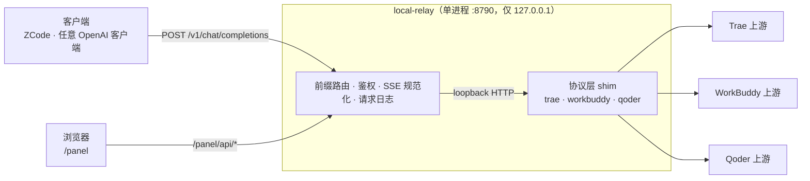

<div align="center">

[English](README.md) · **简体中文**

# local-relay

**把 DSH 三个订阅接入插件的协议层提取出来，做成一个不依赖 DSH、可独立运行的本地 OpenAI 兼容网关。**

一条本地 HTTP 接口，六个模型通道，带控制面板。

[](https://nodejs.org)
[](#开发)
[](#开发)
[](#接入客户端)
[](#已知限制)
[](#许可)

[这是什么](#这是什么) · [特性](#特性) · [工作原理](#工作原理) · [快速开始](#快速开始) ·
[接入客户端](#接入客户端) · [模型命名](#模型命名) · [配置](#配置) · [控制面板](#控制面板) ·
[已知限制](#已知限制) · [常见问题](#常见问题)

</div>

---

## 这是什么

`local-relay` 把三个 DSH 订阅接入插件——`dsh-connect-trae`、`dsh-workbuddy-connect`、`dsh-qoder-connect`——**已经在插件里的协议层原样提取出来**，装配成一个独立进程：

- 对外是一个 **OpenAI 兼容网关**（`/v1/models`、`/v1/chat/completions`，含 SSE 流式），任何支持自定义 OpenAI 接口的客户端都能接；
- 对内是三个通道的协议栈，登录态**直接复用本机客户端的凭据**，不需要另填 API Key、不需要导入账号；
- 附带一个 **React 控制面板**（`/panel`），看额度、切账号、启停模型、跑推理探针、翻请求日志。

它**不是**一个中转/代理服务，不联任何第三方服务器：进程只监听 `127.0.0.1`，凭据只在本机读取，请求直达你已登录的那三个上游。

## 特性

| | |
|---|---|
| **六个通道** | `trae` `traeg`（Trae 国内/国际）、`wb` `wbai`（WorkBuddy 国内/国际）、`qoder` `qoderg`（Qoder 国内/国际）。各自独立的凭据、目录与登录态 |
| **OpenAI 兼容** | `GET /v1/models`、`POST /v1/chat/completions`（流式与非流式）、`GET /healthz`；模型名以 `通道/模型ID` 前缀路由 |
| **流规范化** | 上游 SSE 统一成标准 OpenAI 分片：`role` 只保留首帧、`reasoning_content` 透传、`tool_calls` 增量聚合；非流式请求会聚合出完整 `message` 与 `usage` |
| **零运行期依赖** | 根目录 `package.json` 没有任何 `dependencies`，只用 Node 内置模块；提取来的协议层连同它的依赖桩一起入库，可 diff 审查 |
| **控制面板** | 五个页面：总览、三个通道页、请求日志；额度/签到/模型启停/推理探针/账号切换都在里面 |
| **严格模型路由** | 模型名必须带前缀且命中真实 ID；显示名、漏前缀、大小写错误一律 404 `unknown-model`，绝不静默透传成上游报错 |
| **凭据不出本机** | 面板 API 响应体经过字段白名单过滤，不含 token、PAT、Bearer；日志只记元数据，不记请求/响应正文 |
| **状态隔离** | 网关自己的目录、隐藏名单、探针结果落在 `~/.dsh/local-relay/`，与 DSH 插件互不覆盖 |

## 工作原理



关键点：**这三个插件本身就各自带一个 OpenAI 兼容的 loopback 网关**（`createTraeShim` / `createWorkBuddyShim` / `createQoderShim`，暴露 `/healthz`、`/v1/models`、`/v1/chat/completions`），DSH 的 pi-ai provider 只是它的一个客户端。它们的协议层是纯函数／注入式类（`credential()`、`identity()`、`fetchImpl` 全部外部注入），因此可以脱离 DSH 单独装配。

所以这个项目做的事是：**给这些 shim 补上凭据、目录、偏好这三样外部注入，再把六个 shim 收进一个端口按前缀分发**——而不是从零逆向上游协议。

> `shims/` 下的协议层来自这三个 MIT 许可的包：`dsh-connect-trae`、`dsh-workbuddy-connect`、`dsh-qoder-connect`，连同各自的版权声明一起保留。同一目录下的 `@deepseek-ai/*` 与 `@earendil-works/pi-ai` 不是第三方代码，而是为了能让插件在 DSH 之外被解析而**手写的最小桩**。详见[致谢](#致谢)。

一条请求的完整路径：

1. 客户端用 `通道/模型ID` 调 `/v1/chat/completions`；网关按前缀选 provider，校验模型 ID 真实存在（不存在就 404，不往上游打）。
2. 出站前做通道特有的兼容处理（例如 WorkBuddy 通道会摘掉会被上游 WAF 判为异常的计费头与客户端签名句）。
3. 请求交给该通道的 shim，由插件原本的传输层编码成上游形态（Trae 的 `config_name`、私有 tools 格式，等等）。
4. 上游 SSE 经网关规范化后回给客户端；同时记一条元数据进内存环形缓冲（`/panel/api/logs` 可查，重启即清）。

## 快速开始

**前置要求**

- **Node ≥ 20.3**（我们的代码 18 就够用，但提取的 Qoder / WorkBuddy 协议层用到了 `AbortSignal.any`）；
- 本机装有并**已登录**至少一个客户端：Trae / WorkBuddy（CodeBuddy 体系）/ Qoder。登录态由网关直接读取，不需要复制 token；
- Git Bash / PowerShell / bash 均可。

```bash
git clone <你的仓库地址>
cd local-relay

npm run sync:deps      # 从 shims/node_modules 重建 node_modules（全新 clone 必跑）
npm run build:panel    # 构建控制面板产物（不构建也能用，/panel 会提示 "panel not built yet"）
npm start              # = node src/server.mjs
```

启动后：

| 地址 | 内容 |
|---|---|
| <http://127.0.0.1:8790/v1/models> | 六个通道的模型清单 |
| <http://127.0.0.1:8790/panel> | 控制面板 |
| <http://127.0.0.1:8790/healthz> | 存活探针 |

冒烟一下：

```bash
curl http://127.0.0.1:8790/v1/models

curl http://127.0.0.1:8790/v1/chat/completions \
  -H 'Content-Type: application/json' \
  -d '{"model":"qoder/qmodel_latest","stream":true,
       "messages":[{"role":"user","content":"ping"}]}'
```

> 只想一条命令把前后端都起来（面板带热更新）：`npm run dev`。它会**先等网关就绪再起 Vite**，
> 面板打开即可用，不用手动刷新等后端。构建 + 启动一步到位则是 `npm run start:full`。

## 接入客户端

任何支持「自定义 OpenAI 接口」的客户端都可以，填三样东西：

| 字段 | 值 |
|---|---|
| Base URL | `http://127.0.0.1:8790/v1` |
| API 格式 | Chat Completions（`/chat/completions`） |
| API Key | 未设 `RELAY_KEY` 时任意值；设了则填该值 |
| 模型 | 前缀形式，如 `qoder/qmodel_latest`，见 `/v1/models` |

以 **ZCode** 为例：新建供应商 → 类型选 OpenAI 兼容 → Base URL 填上面的地址 → API Key 随便填 → 模型列表从 `/v1/models` 拉取或手输。

写代码的话就是一个普通的 OpenAI 客户端：

```python
from openai import OpenAI

client = OpenAI(base_url="http://127.0.0.1:8790/v1", api_key="any")
print(client.chat.completions.create(
    model="wb/deepseek-v4.1-flash",
    messages=[{"role": "user", "content": "你好"}],
).choices[0].message.content)
```

## 模型命名

格式：**`通道/模型ID`**（斜杠不能漏，大小写敏感）。

| 前缀 | 通道 |
|---|---|
| `trae/` | Trae 国内版 |
| `traeg/` | Trae 国际版 |
| `wb/` | WorkBuddy 国内版 |
| `wbai/` | WorkBuddy 国际版 |
| `qoder/` | Qoder 国内版 |
| `qoderg/` | Qoder 国际版 |

三条规则：

1. **前缀不能漏、不能错**——`qoder/qmodel_latest` 能路由，`qmodel_latest` 直接 404。
2. **斜杠后面填 `id`，不是显示名。** `/v1/models` 同时给 `id` 与 `name`：`name`（如 `Qwen3.7-Max`）是给人看的，模型选择器显示它，但**别拿它当 ID 填**。
3. **大小写敏感**，且不同通道的同名模型 ID 可能不同（Trae 是 `DeepSeek-V4-Pro-Official`，WorkBuddy 是 `deepseek-v4-pro`）。

```
✅ qoder/qmodel_latest      → 显示为 Qwen3.7-Max
✅ wb/deepseek-v4.1-flash
❌ qoder/Qwen3.7-Max        ← 显示名当 ID，上游拒绝
❌ qmodel_latest            ← 漏前缀
```

具体有哪些模型随账号订阅变化，**一切以 `http://127.0.0.1:8790/v1/models` 的实际返回为准**。

## 配置

### 环境变量

| 变量 | 默认 | 说明 |
|---|---|---|
| `RELAY_PORT` | `8790` | 监听端口（固定绑 `127.0.0.1`） |
| `RELAY_KEY` | 空 | 设了则 `/v1/*` 需要 `Authorization: Bearer <key>` |
| `RELAY_STATE_DIR` | `~/.dsh/local-relay` | 网关状态目录（目录缓存、隐藏名单、探针、通道偏好）；多实例隔离靠它 |
| `RELAY_LOG_CAP` | `500` | 请求日志环形缓冲容量 |
| `RELAY_PANEL_LIVE_TIMEOUT_MS` | `3000` | 面板里「额度/用量」这类真上游读取的等待预算，超时就只报该段读取失败，页面其余部分照常显示 |
| `RELAY_WB_POLL_MS` | `30000` | WorkBuddy 凭据轮询间隔（账号变化后自动重拉目录） |
| `RELAY_QODER_POLL_MS` | `300000` | Qoder 凭据轮询间隔（下限 60s） |
| `RELAY_TRAE_AUTH_FILE` | 自动发现 | 手动指定 Trae 凭据文件 |
| `RELAY_TRAE_EDITION` | 自动发现 | 手动指定 Trae 版本（CN / 国际） |
| `PANEL_PORT` | `5173` | 仅 `npm run dev` 用：Vite 端口 |

### 状态文件

网关自己的状态都在 `~/.dsh/local-relay/`：`catalog.*` / `qoder-catalog.*`（上次拉取的模型目录）、`visibility.*`（模型隐藏名单，按账号）、`probe.*` / `qoder-probe.*`（推理探针结果）、`prefs.*`（通道偏好：区域启停、账号选择、选集、上下文预算）。**刻意与 DSH 插件分开放**——双方都是整文件覆盖写，同跑会互相抹掉；Trae 的凭据副本则是有意共享的。

### npm 脚本

| 命令 | 作用 |
|---|---|
| `npm start` / `npm run dev:gateway` | 起网关 |
| `npm run dev` | 网关 + Vite（先等网关就绪再起前端，面板热更新）；首次需先装面板依赖（`npm run build:panel` 会顺带装上）。Windows 上双击 `dev.cmd` 等价 |
| `npm run build:panel` | 安装面板依赖并构建到 `panel/dist` |
| `npm run start:full` | 构建面板 + 起网关 |
| `npm run sync:deps` | 从 `shims/node_modules` 重建根 `node_modules`（`--force` 强同步） |
| `npm test` | 跑测试（`node --test test/*.test.js`） |

## 控制面板

启动网关后打开 <http://127.0.0.1:8790/panel>。

| 页面 | 内容 |
|---|---|
| 总览 | 六个通道的模型数、登录态与就绪状态、网关端点 |
| Trae | 国内/国际切换、额度（含权益包明细）、签到状态与一键领取、账号切换、模型选集与上下文预算；未登录时列出扫描过的凭据位置与原因 |
| WorkBuddy | 国内/国际切换、额度（总额 + 分包）、目录来源（实时/存档/兜底）、推理探针、模型显示/隐藏开关、倍率与免费标记 |
| Qoder | 国内/国际切换、额度、签到状态与领取、推理探针、模型表（上下文/推理档位/图片/倍率）、PAT 手动录入（只显示尾号） |
| 日志 | 最近请求的元数据（时间/通道/模型/流式/结果/耗时），5 秒轮询，失败行高亮 |

**三个会真的做事的按钮**（不是纯展示）：

- **Trae「领取签到」**——已签或活动未开启时不会打上游；每天只能领一次；
- **WorkBuddy / Qoder「探针」**——**会真发上游请求并消耗额度**，逐个模型点击触发，所以整块默认收起；
- **WorkBuddy「显示/隐藏」**——按账号持久化，重启后仍生效，隐藏的模型不会出现在对话服务里。

## 已知限制

- **主要验证平台是 Windows**；凭据发现逻辑来自插件（Windows 注册表 / 常见安装路径），macOS / Linux 未实测。
- **必须本机登录过对应客户端**。网关只读取登录态，不代登录、不刷新密码。
- WorkBuddy 5.6 起凭据文件是加密的，解密需要临时调用 WorkBuddy 自己的二进制——**app 得在**，且首次读取会慢一点。
- 只实现 **Chat Completions + Models**：没有 embeddings、responses、audio、images 端点；Anthropic Messages 协议需要另配转换层。
- **面板 API 不受 `RELAY_KEY` 保护**（只有 `/v1/*` 校验）。网关只绑 `127.0.0.1`，所以仅本机可访问；若你改绑对外地址，请自行加防护。
- 上游额度耗尽 / 排队 / 风控都会如实以 4xx/5xx 透出，网关不重试、不轮换账号。

## 安全与免责

- 网关**只监听 `127.0.0.1`**，不对外提供服务；面板 API 的响应体经过字段白名单过滤，不含 token / PAT / Bearer；请求日志只记元数据（通道、模型、状态、耗时），不记正文。
- 请**仅用于本机自用**。你调用的仍是你自己的订阅账号，必须遵守 Trae / WorkBuddy / Qoder 各自的服务条款；不要用它分享账号、转售额度或绕过计费。
- 本项目不包含、不分发任何账号凭据，也不与上述厂商有关联；上游接口与模型名随时可能变动，**请以 `/v1/models` 的实际返回为准**。
- 使用风险自负。

## 常见问题

**Q：`/v1/models` 报 401？**
设了 `RELAY_KEY` 就得带上 `Authorization: Bearer <key>`（或 `x-api-key`）。

**Q：报 `no such model` / `unknown-model`？**
模型名必须是 `通道/模型ID`：检查前缀、检查是不是把 `name` 当成了 `id`、检查大小写。列表以 `/v1/models` 为准。

**Q：某个通道显示未登录？**
网关不代登录。请在本机对应客户端登录一次，然后刷新面板；Trae 页在未登录时会直接列出扫描过的凭据路径与失败原因，照它提示放文件或设 `RELAY_TRAE_AUTH_FILE`。

**Q：面板里额度显示"读取失败/未在 3000ms 内返回"？**
额度和用量是真打上游的请求。上游慢时面板会按 `RELAY_PANEL_LIVE_TIMEOUT_MS`（默认 3 秒）放弃等待并如实标注，模型列表和设置不受影响。想让额度也等久一点就调大这个值。

**Q：能不能接 Claude Code / Anthropic 系客户端？**
网关只讲 OpenAI 的 Chat Completions，Anthropic Messages 需要中间转换层。另外 Qoder 上游会拒绝历史里的 `thinking` 内容块（`unsupported content part type "thinking"`），带思考回填的客户端走 Qoder 通道会失败。

**Q：能和 DSH 插件同时跑吗？**
可以。两边状态目录是分开的（`~/.dsh/local-relay/` vs `~/.dsh/`），凭据只读不写。但**不要**把两个进程的端口配成同一个。

**Q：端口被占用？**
`RELAY_PORT=8791 npm start`。

## 开发

```
local-relay/
├── src/
│   ├── server.mjs              # 入口：前缀路由 · 鉴权 · SSE 规范化 · 请求日志
│   ├── providers/              # 三个通道的装配（凭据/目录/偏好注入 shim）
│   ├── panel/                  # 面板 API 与静态托管
│   ├── workbuddy-compat.mjs    # WorkBuddy 通道的出站兼容处理
│   ├── channel-prefs.mjs       # 通道偏好持久化
│   ├── checkin-scheduler.mjs   # Qoder 自动签到
│   └── state-dir.mjs           # 状态目录
├── shims/node_modules/         # 入库的核心资产：提取的协议层 + DSH 依赖桩
├── panel/                      # React + Vite 控制面板（改前端只需 vite build）
├── test/                       # node:test，116 项
└── scripts/                    # dev（前后端一起起）· sync-deps
```

```bash
npm test                 # node:test，全部用例
npm run dev              # 开发态：网关 + 面板热更新
npm run sync:deps -- --force   # 改了依赖桩之后必须重跑，否则读的还是旧副本
```

改动生效方式：**后端改动要重启网关**；纯前端改动 `npm run build:panel` 后刷新浏览器即可。（`shims/node_modules/` 是入库的源——提取来的协议层与依赖桩，可 diff 审查；根 `node_modules/` 只是它的副本，由 `sync:deps` 重建，别手改。）

## 致谢

本项目能成立，靠的是这三个插件已经把协议层写好并公开：

| 包 | 许可 | 在本项目里的角色 |
|---|---|---|
| [`dsh-connect-trae`](shims/node_modules/dsh-connect-trae) | MIT | Trae 的凭据发现/刷新、请求编码、SSE 解码与工具调用桥接、模型目录路由 |
| [`dsh-workbuddy-connect`](shims/node_modules/dsh-workbuddy-connect) | MIT | WorkBuddy 的凭据存储与 at-rest 解密、目录与可见性、推理探针 |
| [`dsh-qoder-connect`](shims/node_modules/dsh-qoder-connect) | MIT | Qoder 的 PAT 校验与传输、账号/额度读取、签到 |

它们的代码与版权声明一并保留在仓库的 `shims/` 下（未做改动，仅做装配）。`shims/node_modules/@deepseek-ai/*` 与 `@earendil-works/pi-ai` 是本项目手写的 DSH 运行时桩，只为让上述包能在 DSH 进程外被解析，不属于第三方代码。

## 许可

[MIT](LICENSE) © 2026 lunesnow。使用前请阅读上方的[安全与免责](#安全与免责)。`shims/` 下的第三方代码仍归各自作者所有，按其原有许可（均为 MIT）分发。
